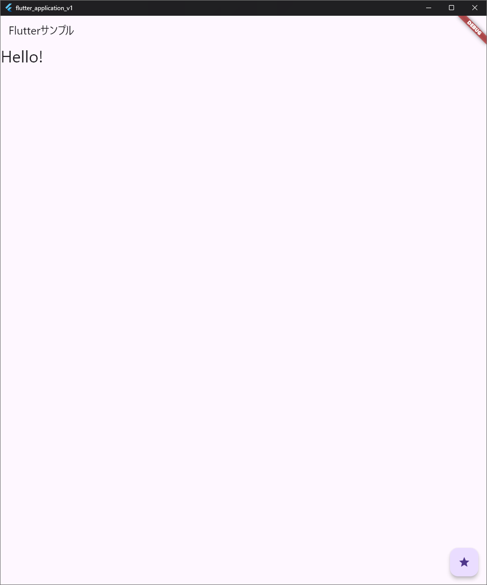

## 2025/05/21
今日の進捗
- GitHubのリポジトリに追加ファイルをpush
- flutterのStatefulWidgetの使い方を学ぶ
- floatingActionButtonの使い方を学ぶ
- Windowsでの動作テスト

## ドキュメント
[flutter StatefulWidget](https://api.flutter.dev/flutter/widgets/StatefulWidget-class.html)


[flutter FlutterActionButton](https://api.flutter.dev/flutter/material/FloatingActionButton-class.html)

## 全体のコード

```dart
import 'package:flutter/material.dart';

void main() {
  runApp(const MyApp());
}

class MyApp extends StatelessWidget {
  const MyApp({Key? key}) : super(key: key);
  final title = 'Flutterサンプル';

  @override
  Widget build(BuildContext context) {
    return MaterialApp(
      title: 'Flutter Demo',
      home: MyHomePage(
        title:this.title,
      ),
    );
  }
}

class MyHomePage extends StatefulWidget {
  const MyHomePage({required this.title}): super();
  final String title;

  @override
  _MyHomePageState createState() => _MyHomePageState();
}

class _MyHomePageState extends State<MyHomePage> {
  // initial message
  String _message = 'Hello!';

  // when pressed, change the message
  void _setMessage() {
    setState(() {

      _message = _message == 'タップしました！' ? 'Hello!' : 'タップしました！';  
    });
  }

  // build method
  // This method is called when the widget is built
  @override
  Widget build(BuildContext context) {
    return Scaffold(
      appBar: AppBar(
        title: Text(widget.title),
      ),
      body: Text(
        _message,
        style: TextStyle(fontSize:32.0),
      ),
      floatingActionButton: FloatingActionButton(
        onPressed: _setMessage,
        tooltip: 'メッセージを変更',
        child: Icon(Icons.star),
      ),
    );
  }
}
```

以下の部分を修正

```dart
  // when pressed, change the message
  void _setMessage() {
    setState(() {
      _message = _message == 'タップしました！' ? 'Hello!' : 'タップしました！';  
    });
  }
```

## 動作画面

