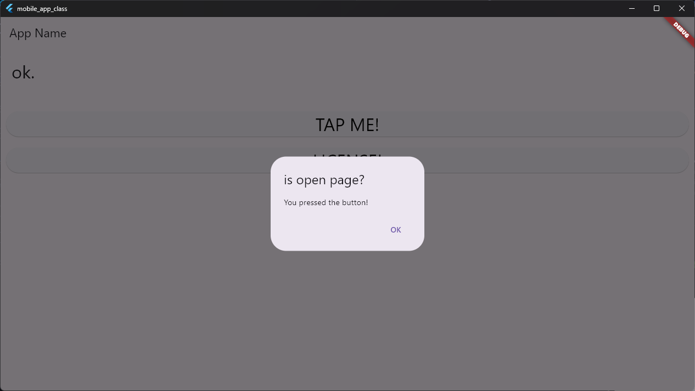
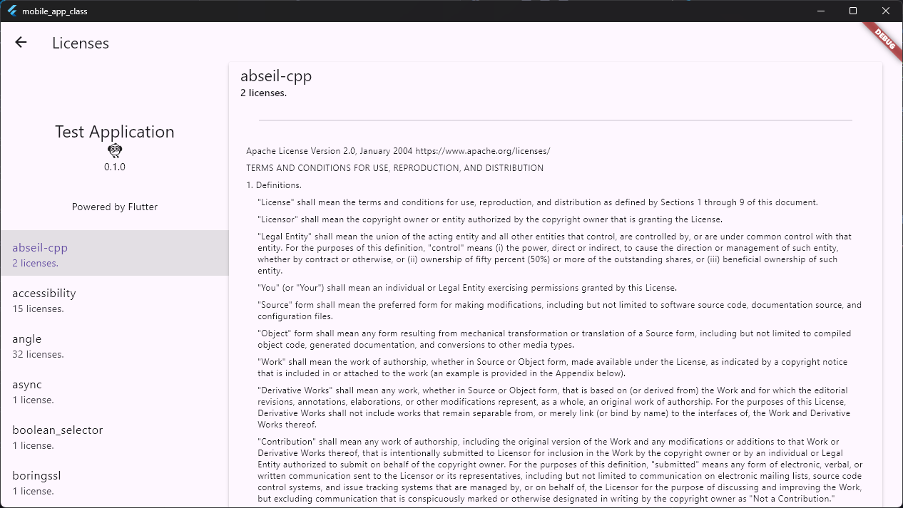

# 2025/06/03

ソースコード
https://github.com/nknighta/mobile-app-practice.git

## flutter dialog

ダイアログ+ボタンイベント
イベント名 buttonPressed
```dart
void buttonPressed(){
    showDialog(
        context: context,
        builder: (BuildContext context) => AlertDialog(
          title: Text("is open page?"),
          actions: <Widget>[
            TextButton(
              child: Text("OK"),
              onPressed: () {
                Navigator.of(context).pop();
              },
            ),
          ],
            content: Text("You pressed the button!"),
        )
    );
  }
```

呼び出し側
```dart
ElevatedButton(
  onPressed: buttonPressed,　// イベント名
  child: Text("Open Dialog"),
),
```

ボタンイベント+ライセンスリンク
```dart
void showLicense() {
    showAboutDialog(
      context: context,
      applicationName: 'Test Application',
      applicationVersion: '0.1.0',
      applicationIcon: Icon(Icons.flutter_dash),
      children: [
        Text('this is flutter practice application.'),
        Text('This application is for learning Flutter.'),
      ],
    );
  }
  // ライセンス画面表示
```

## ダイアログ


## ライセンス画面
