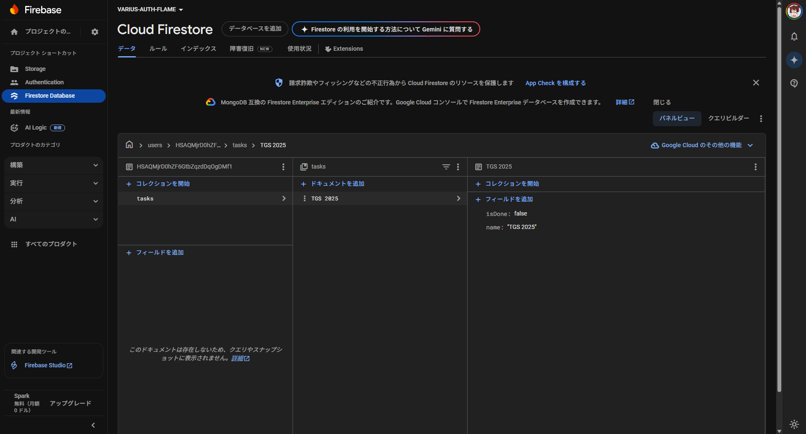

# Firebase + Flutter + Firestore

## Firestoreへのtodoの追加
<strong>事前のFirebaseの設定が必要</strong>

保存する部分
```dart
// 省略
Future<void> _saveTaskToFirestore(Task task) async {
    if (_currentUser == null) return;
    await FirebaseFirestore.instance
        .collection('users')
        .doc(_currentUser!.uid)
        .collection('tasks')
        .doc(task.name)
        .set(task.toJson());
  }
// 省略
```

FirestoreはNoSQLかつドキュメントベースなので用意にDBを構築できる
ただし<strong>適切に処理を行わないと意図しないデータが保存される</strong>ので注意

保存後のFirebaseコンソールの画面

